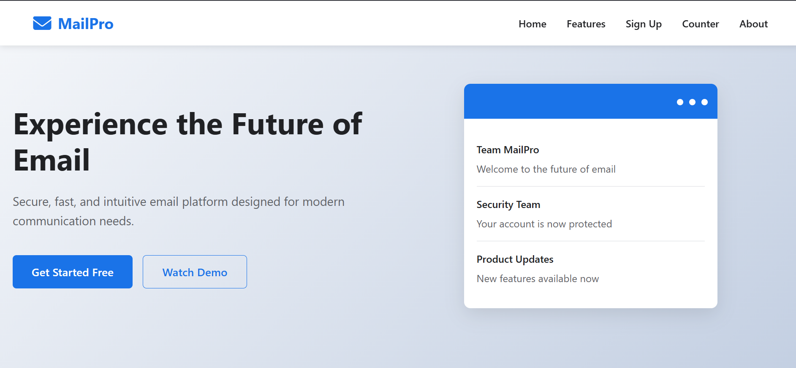
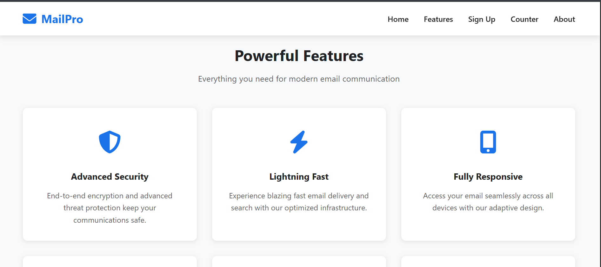
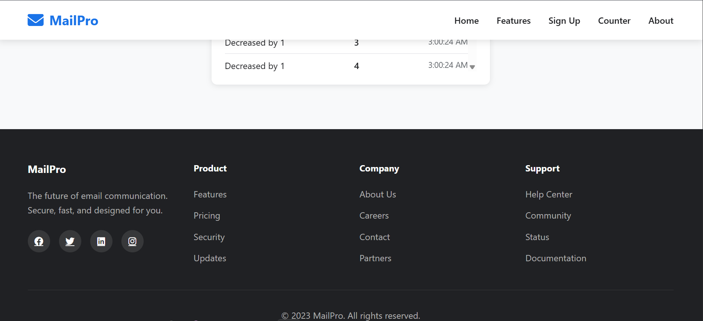

# Mail pro - Complete Project

This project is a responsive landing page that meets all specified requirements including:

## Features Implemented

### Task 1: Responsive Landing Page
- ✅ Semantic HTML structure
- ✅ Navigation bar with smooth scrolling
- ✅ Hero section with call-to-action buttons
- ✅ Features section with animated cards
- ✅ Fully responsive design (mobile, tablet, desktop)
- ✅ Modern animations and transitions
- ✅ Professional footer with links

### Task 2: Interactive Form
- ✅ User registration form with validation
- ✅ Real-time error messages
- ✅ Password strength indicator
- ✅ Input focus and blur events
- ✅ Clean, professional styling
- ✅ Success confirmation message

### Task 3: Basic DOM Manipulation
- ✅ Counter application with increment, decrement, and reset
- ✅ Prevents going below zero
- ✅ Keyboard support (arrow keys, +, -, R)
- ✅ History tracking
- ✅ Minimalistic design
- ✅ Button state management

## Technologies Used
- HTML5 (semantic elements)
- CSS3 (Flexbox, Grid, Media Queries)
- Vanilla JavaScript (ES6+)

# what it looks like:

## File Structure

# Author
Halima Muktar 
